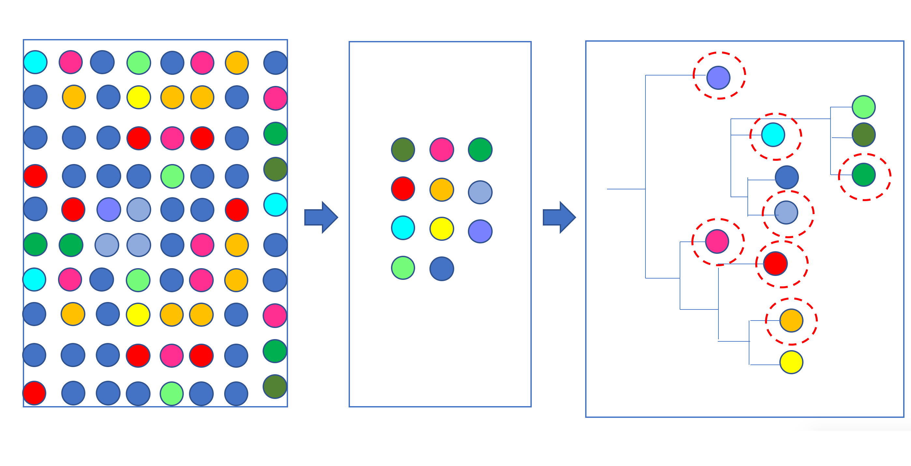
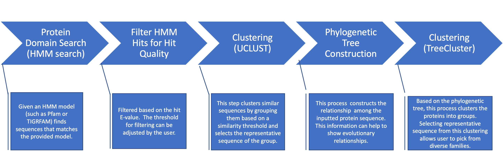

# Presentation
## Objective

*This project is inspired by work I previously conducted at a company. Due to an NDA, I cannot share specific details of the pipeline or data, so this is a recreation with limited computational resources.

The objective of this scipt is to mine for protein domain of interest in a large collection of microbial genomes, derived from both isolates and metagenomic sequences. It aims to extract meaningful insights by reducing redundancy, selecting representative sequences, and clustering proteins at multiple levels to capture diversity. This approach supports the identification of sequences with potential for improved performance or novel taxonomies carrying the protein of interest.

## Rationale
Microbial genomes contain a wealth of protein sequence diversity, but analyzing such large datasets can be both computationally intensive and resource-demanding. This script streamlines the process by searching for protein domain of interest, clustering at multiple levels, and nomination. This reduces redundancy while preserving functional and evolutionary diversity. By selecting representatives from diverse families, the workflow ensures that downstream computational and wet-lab analyses focus on the most informative sequences, saving both time and resources. The ability to find sequences from novel taxonomies may increase the potential for discovering proteins with better or more desireable functionality or for new applications. This makes this script useful for exploring protein diversity in large-scale genomic datasets.

## Workflow 

### HMM Search
***Purpose:*** To identify sequences that match specific protein families or patterns in a large sequence database.

***Why this choice?:*** HMM search is sensitive and precise method for finding sequence matches, making it a useful tool for finding specific protein families. Since the goal is to identify similar proteins across diverse taxonomies, including potentially distantly related ones, HMM search provides a flexible and comprehensive approach compare to BLAST.

### UCLUST Clustering
***Purpose:*** To group similar sequences into clusters based on a similarity threshold.

***Why this choice?:*** UCLUST reduces redundancy and simplifies the dataset by grouping nearly identical sequences, which saves computational resources and improves downstream analyses. Since this pipeline is meant to be ran on large (and multiple) databases, UCLUST's optimization for fast and efficient clustering makes it a good candidate for an initial clustering step, particularly for OTU clustering. 

### Phylogenetic Tree Construction
***Purpose:*** To show relationships between the representative sequences.

***Why this choice?:*** A phylogenetic tree visually represents how the sequences are related, providing insights into possible ancestral relationships and sequence diversity.

### TreeCluster 
***Purpose:*** To organize sequences into distinct clusters based on their relationships calculated in the phylogenetic tree.

***Why this choice?:*** By grouping sequences into clusters based on their phylogenetic relationship, it makes complex trees easier to interpret and also helps to identify biologically meaningful groupings. By including this step, it enables another layer of clustering and representative sequence selection from a diverse family in an effecive manner.

## Discussion
### Result (on test database and test hmm model)
Due to computational restrictions, the test database is significantly smaller compare to this pipeline's intended purpose of searching through multiple large databases and compiling results into meaningful representatives for further investigations. 
Input Test Database Preparation: 
Fetched bacterial protein sequences from NCBI RefSeq database using FTP link. Due to restriction in disk space, I used Entrez API to fetch sequences belonging to organisms in the phylum of Firmicutes and randomly selected 3/10 of the sequences to be incorporated into the mini-database. 

Input HMM model Preparation:
Downloaded a Cry Toxin domain, Insecticidal Crystal Toxin P42 Toxin10 (PF05431), from Pfam.

### Result Summary: 

|                                       | Number of Sequence |
|---------------------------------------------|-------|
| Total number of HMM hits                    | 159   |
| Number of HMM hits after filtering          | 112   |
| Number of representative (clusters) sequences after uclust | 91    |
| Number of representatives (clusters) after TreeCluster            | 8    |
| Number of total singletons (-1)             | 3     |

### Findings: 
1. Singletons:
      - There were a total of 3 singletons after TreeCluster. These could be either highly divergent sequences or noise. If this is noise, introducing a step to filter out HMM hits that have a greater match with an existing domain could eliminate it. Otherwise, it would be worth pulling the taxonomic classification of the singletons' origin or performing 3D structural analysis.

2. Number of representative sequences from UCLUST to TreeCluster:
      - There was a significant drop in the number of representative sequences between UCLUST and TreeCluster, from 91 to 8. The threshold for UCLUST was 0.9, and the threshold for TreeCluster was 0.5. This suggests that the threshold for UCLUST created relatively fine-grained clusters, while the threshold calculated for TreeCluster may have been too loose. It could be beneficial to adjust the maximum cap for the threshold for TreeCluster.
        

### What Would I Do Differently or as Next Steps?

1. **Add Another Filtering Step for HMM**
   - I would add a step in the filtering process for HMM hits by using `hmmscan`. By comparing each HMM hit against a database of existing models, it would identify whether a sequence has a better match to another known model and exclude such sequences from further downstream analyses.
   - Sequences with better hits to existing models likely belong to well-characterized families and would be less relevant to the objective of the search. This would reduce noise and increase target-specific or novel sequences for further analyses.

2. **Include Taxonomic Profiling**
   - I would include a step that either retrieves the lineage for each hit sequence or integrates tools such as Kraken2 or GTDB-tk for sequences with missing classifications. This would enable the analysis of the taxonomic composition of clusters.
   - This would reveal whether certain functions or proteins are associated with specific lineages. It would be useful in identifying potential novel taxa carrying the protein or function of interest.

3. **Incorporate Structure-Based Analysis**
   - I would add (1) an option for utilizing structure-based analysis, such as AlphaFold, as the initial search for hits and (2) an option to predict the 3D structure of representative sequences for the investigation of functional or structural divergence across clusters.
   - This modification would enable a search that might be missed by a sequence-based approach and could provide biologically meaningful insights beyond sequence similarity within clusters.

# computational_project_example
The purpose of this bioinformatics pipeline is to mine for protein domains in a given database. The goal is to identify sequences which may have better performance and/or novel taxonomies carrying a protein of interest. This script streamlines the process of identifying, clustering, and analyzing protein sequences to extract meaningful insights from large protein datasets. By clustering sequences and selecting representative proteins, it significantly reduces redundancy and simplifies downstream analyses. 

## Method:
1.  The pipeline uses HMMR to screen for hits to query a HMM model in a protein database
2.  Use UClust to get representative sequences (to reduce redundancy)
3.  Use mafft to align the representative sequences selected using UCLUST
4.  Use FastTree to create a phlygenetic tree
5.  Use TreeCluster to pick sequences from diverse families

## Environment and Packages: 
- Python >= 3.8
- Packages:
  - ete3
  - numpy
  - six
   
- Tools:
 
    - HMMER, Version: ≥ 3.3.2
    - seqtk, Version: ≥ 3.3.2
    - UCLUST, Version: ≥ 11.0.667 
    - MAFFT, Version:  ≥ 7.505
    - FastTree, Version: ≥ 2.1.11
    - TreeCluster, Version: ≥ 1.0.0
     
## Input Files: 
- Protein database: FASTA format (.faa)
  - Example: RefSeq 
- HMM profile: HMM file (.hmm)

## Running Nextflow Script
` nextflow run main.nf --protein_db example-data/proteins.faa --hmm_model example-data/model.hmm
`

## Steps in the Script

#### 1.  HMM Search 
- Searches the protein database using the HMM model to identify sequences with conserved domains or motifs.
- Produces a raw output file listing potential matches with scores and alignments.

#### 2. Filter Hits
- Filters the HMM search results based on quality thresholds (E-value)

#### 3. CLUST Clustering
- Groups similar protein sequences based on sequence identity.
- Outputs representative sequences for each cluster, reducing redundancy in the dataset.

#### 4. Tree Construction
- Aligns the representative sequences and builds a phylogenetic tree in Newick format.
- Represents relationships among the sequences.

#### 5. Threshold Calculation For Clustering
- Calculate the pairwise distances in the phylogenetic tree to compute an appropriate clustering threshold
- Caps or scales the threshold if necessary to ensure meaningful clustering.

#### 6. Clustering with TreeCluster
- Clusters sequences based on the phylogenetic tree and the calculated threshold.

#### 7. Representative Sequence Selection
- For each cluster, randomly selects one sequence to represent the group.
- (Includes all sequences from singleton clusters ) 

#### 8. Summary Generation 
- Compiles a summary report with: 
    - Total number of HMM hits.
    - Number of filtered hits.
    - Number of representative sequences.
    - Number of singleton and non-singleton clusters.
